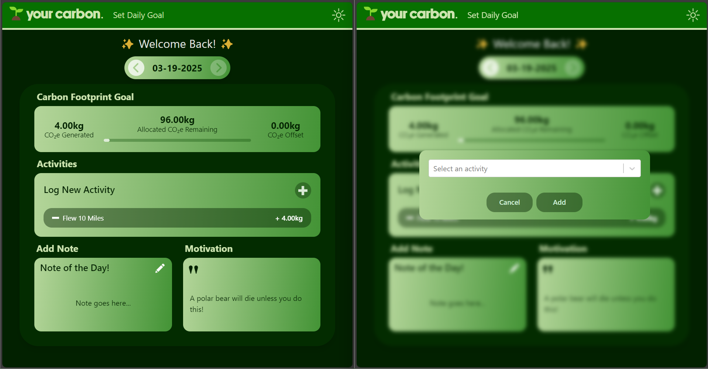
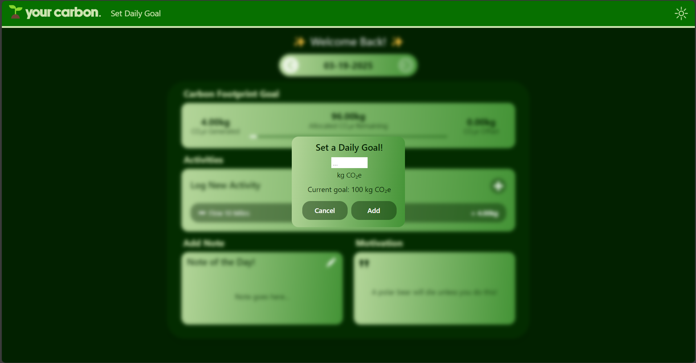
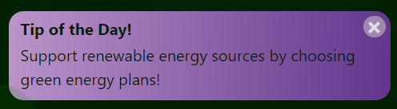
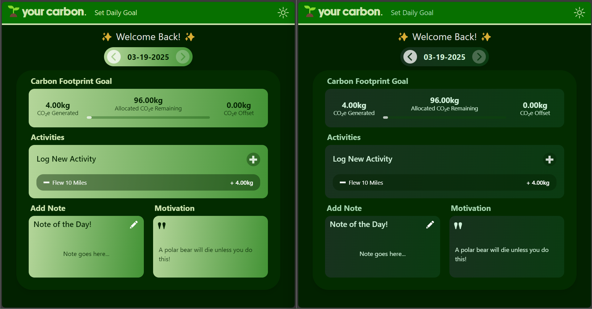
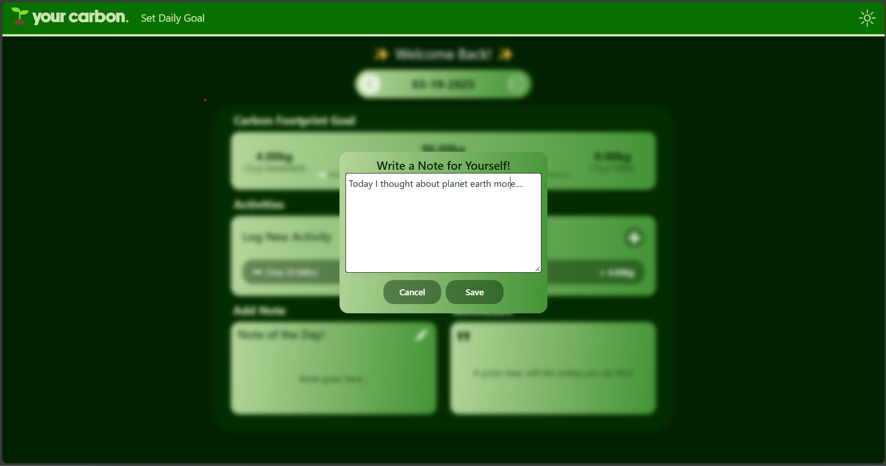

# Your Carbon 🌱
## The React App for Tracking your Carbon Footprint!

Your Carbon is a React web application designed to help you track your carbon footprint for each day, helping you become more conscious of your environmental impact! All within a sleek UI.

https://github.com/user-attachments/assets/cba3a5c7-dbfe-437b-b182-05930409ffd1

## Features
### Activity Logging
You can log your daily activities with the "Log New Activity" module. Simply click on the plus button, choose the appropriate activity from the pop-up menu, fill in the specifics, and click add! If you want to remove any activity, click on the minus button on said activity. Additionally, you can view your progress from previous days by switching between dates!

### Goal Setting
It's important to set a goal for your carbon footprint each day, so you can click on 'Set Daily Goal' to do so! You can even set a different daily goal for each day. With each activity added, the goal module will update to reflect the amount of carbon you've generated and how much you've offset. A progress bar will also fill up to reflect how far you are from your daily limit.

### Notifications
Each day, the app will let you know of a different way you can reduce your carbon footprint, reminding you of your responsibility to reduce energy waste and to keep you on track to meet your goals!

### Customizable UI
To accomodate to your own personal style, you can switch between light mode and dark mode with the click of the sun icon! These styles will be further refined in a future update.

### Note Taking
For each day, you can add your own personal note to your dashboard to keep you motivated. Perhaps you would like to share a note on how you became more environmentally conscious that day!

### Local Storage
To keep all your goals and activities intact, this application uses local storage on your browser to save your activity data, goal data, and note data for each day.

## How to Run
Simple download all the files from this repository, and in your terminal type 'npm install' and then 'npm run dev' to run this proof-of-concept!
